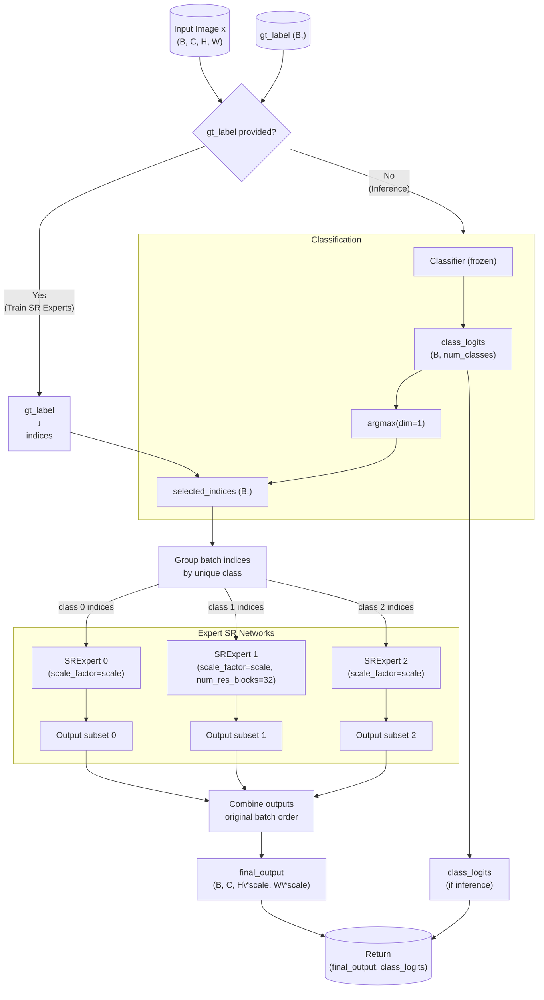

# 多任务学习 - Adaptive SR

## 简介

- 目标：实现不同图片场景的分类超分

- 方式：通过先对图片进行分类，选择专门的专家网络进行超分

- 分类：共3类
  - *Anime / Illustration (anime)*

  - *Real World / Photo (landscape)*

  - *Text / Screenshot (text)*

## 复现

- 训练：修改config.yaml后运行train.py

- 评估：

  ```bash
  python evaluate.py \
  	--class-data <path/to/classification_dataset>
  	--sr-data <path/to/dataset>
  	--class-weights <path/to/classifier_weights>
  	--sr-weights <path/to/sr(fused)_weights>
  	--scale 2
  	--device <cuda_or_cpu>
  	--class-batch 32
  	--sr-batch 8
  	--num_workers 4
  	--seed <random_seed>
  	--out-csv <path/to/results_file>
  ```

- 推理：

  ```bash
  python inference.py \
  	--image <path/to/input/single_image>
  	--output <path/to/output/single_image>
  	--input-dir <path/to/folder/images>
  	--output-dir <path/to/output/folder>
  	--class-weights <path/to/classifier_weights>
  	--sr-weights <path/to/sr(fused)_weights>
      --scale 2
  	--device <cuda_or_cpu>
  	--patch-size <patch_size_to_split_image>
  	--overlap <overlap_size_to_crop>
  ```

## Web

Web demo：[v2_web](v2_web)

在线推理：[https://wyywn.site/projects/adaweb/](https://wyywn.site/projects/adaweb/)

## 数据

- 来源：

  - *anime*：网络收集的高质量图片，带有丰富细节

  - *landscape*：DIV2K节选


  - *text*：网页、PPT、PDF截图

### 1. 分类

- 总量：

  | 类别/数据集 | train | val  | test |
  | ----------- | ----- | ---- | ---- |
  | anime       | 719   | 90   | 90   |
  | landscape   | 716   | 89   | 90   |
  | text        | 627   | 78   | 79   |

- 处理：
  1. 将原图统一缩放到224×224，并确保原图长宽比不超过2.5:1
  2. 按8:1:1分割训练、验证、测试集

### 2. 超分

- 总量：

  | 类别/数据集 | train | val  | test |
  | ----------- | ----- | ---- | ---- |
  | anime       | 4640  | 580  | 580  |
  | landscape   | 4640  | 580  | 580  |
  | text        | 4640  | 580  | 580  |

- 处理：
  1. 原图切分为224×224的小块
  2. 通过计算每个小块图片的评分筛选有实际内容的图片，作为HR图
  3. 将HR图片缩放到112×112，作为LR图

## 网络结构

*SRNet、ClassNet与task1、task2的网络结构定义完全相同，省略*



*说明：v2版本对SRExpert 1的num_res_blocks数量翻倍处理为32（v1版本为16）*

## 指标

### 分类

| 组别             | 准确率 |
| ---------------- | ------ |
| 分类集/test      | 96.14% |
| 超分集/thumbnail | 95.25% |

### 超分

| 组别      | 类别      | PSNR (dB) | SSIM   | 总计 |
| --------- | --------- | --------- | ------ | ---- |
| oracle | overall   | 33.49     | 94.76% | 1740 |
| oracle | anime     | 34.07     | 95.54% | 580  |
| oracle | landscape | 30.09     | 89.50% | 580  |
| oracle | text      | 36.30     | 99.25% | 580  |
| mixed  | overall   | 33.48     | 94.75% | 1740 |
| mixed  | anime     | 34.09     | 95.54% | 580  |
| mixed  | landscape | 30.06     | 89.46% | 580  |
| mixed  | text      | 36.29     | 99.25% | 580  |
| random | overall   | 31.89     | 93.82% | 1740 |
| random | anime     | 33.20     | 94.88% | 580  |
| random | landscape | 29.27     | 88.06% | 580  |
| random | text      | 33.20     | 98.51% | 580  |
| fixed_0 | overall   | 31.51753 | 0.939273 | 1740 |
| fixed_0 | anime     | 34.06795 | 0.955371 | 580  |
| fixed_0 | landscape | 29.21245 | 0.881571 | 580  |
| fixed_0 | text      | 31.27219 | 0.980878 | 580  |
| fixed_1 | overall   | 31.9284  | 0.943383 | 1740 |
| fixed_1 | anime     | 33.86863 | 0.953352 | 580  |
| fixed_1 | landscape | 30.08886 | 0.895028 | 580  |
| fixed_1 | text      | 31.8277  | 0.98177  | 580  |
| fixed_2 | overall   | 32.18666 | 0.931728 | 1740 |
| fixed_2 | anime     | 31.75472 | 0.93711  | 580  |
| fixed_2 | landscape | 28.50525 | 0.865537 | 580  |
| fixed_2 | text      | 36.30001 | 0.992539 | 580  |

*说明：oracle - 只超分（理想专家）， mixed - 网络整体（实际分类+专家）， random - 随机专家， fixed_n 固定专家*

与Task1的对比：

| 任务/专家 | 数据集     | PSNR (dB) | SSIM   | 总数 |
| --------- | ---------- | --------- | ------ | ---- |
| Task1     | Task1/test | 43.25     | 0.9954 | 630  |
| 多任务/0  | Task1/all  | 41.18     | 0.9833 | 4197 |
| 多任务/1  | Task1/all  | 42.01     | 0.9857 | 4197 |
| 多任务/2  | Task1/all  | 39.07     | 0.9758 | 4197 |

### 分析

- **分类器**
  - 分类器在测试集上的准确率达到96.14%，在超分任务缩略图上也达到了95.25%，说明模型能够有效区分三种不同类型的图像，为后续选择适合的超分专家网络提供了可靠依据。
- **专家网络**
  - 从 `oracle`（理想专家）和 `mixed`（实际分类+专家）的结果看，两者的PSNR和SSIM指标非常接近（分别为33.49和33.48），SSIM 分别为94.76%和94.75%，说明分类器几乎没有引入性能损失，能够准确地为每类图像分配最合适的专家网络。
  - 对比 `random`（随机选择专家）的结果，整体PSNR降至31.89，SSIM降至93.82%，明显低于前两者；固定某一专家网络对所有数据评测（`fixed_n`），在对应的数据上指标最高，说明专门化的专家网络对不同类型图像的超分效果确实优于通用或随机分配的网络。
- **不同类别**
  - 在所有设置中，`text` 类别的超分效果最好（PSNR 36.30，SSIM 99.25%），可能是因为文本图像具有清晰的边缘和结构，易于重建。
  - `landscape` 类别的超分效果相对较差（PSNR 30.06，SSIM 89.46%），说明自然图像细节丰富、纹理复杂，超分难度较大。
  - `anime` 类别的效果居中（PSNR 34.09，SSIM 95.54%），说明其具有一定的结构性和纹理特征，但仍能较好地重建。

- **为何Task1与多任务的PSNR指标相差大**
  - 多任务模型在自身的数据上PSNR 33.5dB，但迁移到Task 1的数据之后，没有经过微调就达到了42.01dB，说明Task 1模型指标高主要是因为自身数据较为简单，任务难度比较低；而多任务模型能够在从未见过的数据上表现较好，性能更好。
