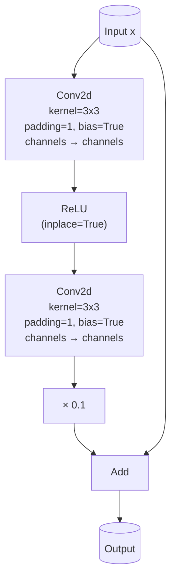
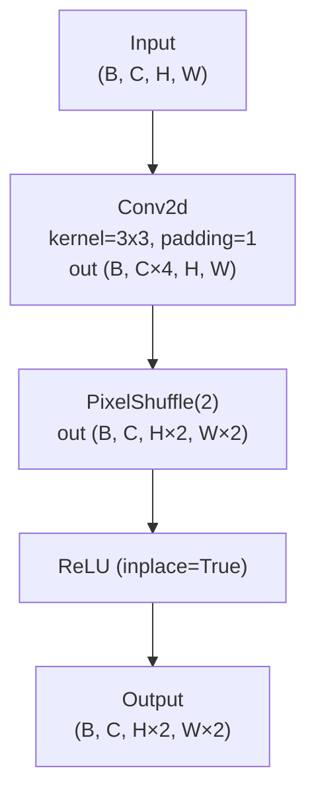
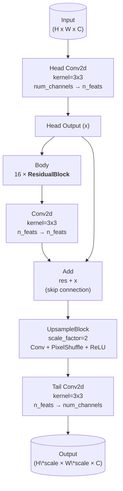

# Task1 - 超分

## 复现

- 训练：修改config.yaml后运行train.py

- 评估：修改evaluate.py中exp_folder和model_path并运行

- 测试图片：

  ```bash
  python test.py \
      --input <path/to/image_or_dir> \
      --output <path/to/output/dir> \
      --model <path/to/model.pth>
  ```

## 数据

- 来源：手机拍摄的白板笔记

- 处理：

  1. 手动将高清图片切除边缘空白部分

  2. 把图片压缩/缩放到长边长2048，使用LANCZOS算法

  3. 自动分割成小块图像（256×256）作为HR图片
  4. 把HR图片缩小到128×128，使用BICUBIC算法，作为LR图片
  5. 自动划分数据为70%训练，15%验证，15%测试

## 网络结构

### Residual Block



### UpsampleBlock




### SRNet



## 指标

测试集平均PSNR 43.25 dB