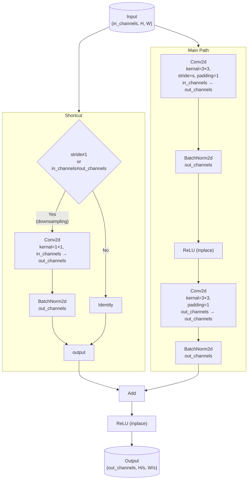

# Task2 - CIFAR分类

## 复现

- 训练：修改config.yaml后运行train.py

- 评估：

  ```bash
  python evaluate.py \
  	--exp-dir <path/to/exp/dir>
  	--model-file <model_file_name>
  	--device <cuda_or_cpu>
  	--batch-size 16
  	--num-workers 10
  	--data-root <path/to/cifar10_data>
  ```

## 数据

- 来源：CIFAR10

## 网络结构

### ResidualBlock



### ClassNet

```mermaid
graph TD
    Input[("Input Image<br>(3, H, W)")] --> Head

    subgraph Head [Head]
        direction TB
        HeadConv["Conv2d<br>kernal=3×3,<br>padding=1<br>3 → 64"] --> HeadBN["BatchNorm2d 64"]
        HeadBN --> HeadReLU["ReLU (inplace)"]
    end
    HeadReLU --> Layer1

    subgraph Layer1 [Layer1, blocks = b1]
        direction TB
        L1_RB1["ResidualBlock<br>64 → 64<br>stride=1"] --> L1_RB2["ResidualBlock<br>64 → 64<br>stride=1"]
        L1_RB2 --> L1_RBx["... (b1-2 more blocks)"]
    end
    Layer1 --> Layer2

    subgraph Layer2 [Layer2, blocks = b2]
        direction TB
        L2_RB1["ResidualBlock<br>64 → 128<br>stride=2"] --> L2_RB2["ResidualBlock<br>128 → 128<br>stride=1"]
        L2_RB2 --> L2_RBx["... (b2-2 more blocks)"]
    end
    Layer2 --> Layer3

    subgraph Layer3 [Layer3, blocks = b3]
        direction TB
        L3_RB1["ResidualBlock<br>128 → 256<br>stride=2"] --> L3_RB2["ResidualBlock<br>256 → 256<br>stride=1"]
        L3_RB2 --> L3_RBx["... (b3-2 more blocks)"]
    end
    Layer3 --> GAP["Average Pooling<br>(adaptive_avg_pool2d)"]
    GAP --> Flatten["Flatten"]
    Flatten --> FC["Linear<br>256 → class_nums"]
    FC --> Output[("Class Scores<br>(class_nums)")]
```



## 指标

| 准确率 | 正确 | 总计  |
| ------ | ---- | ----- |
| 86.13% | 8613 | 10000 |

